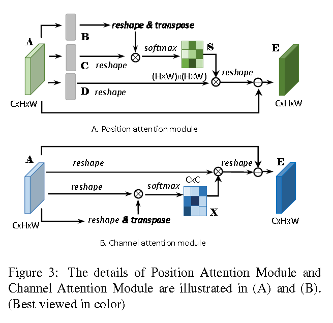
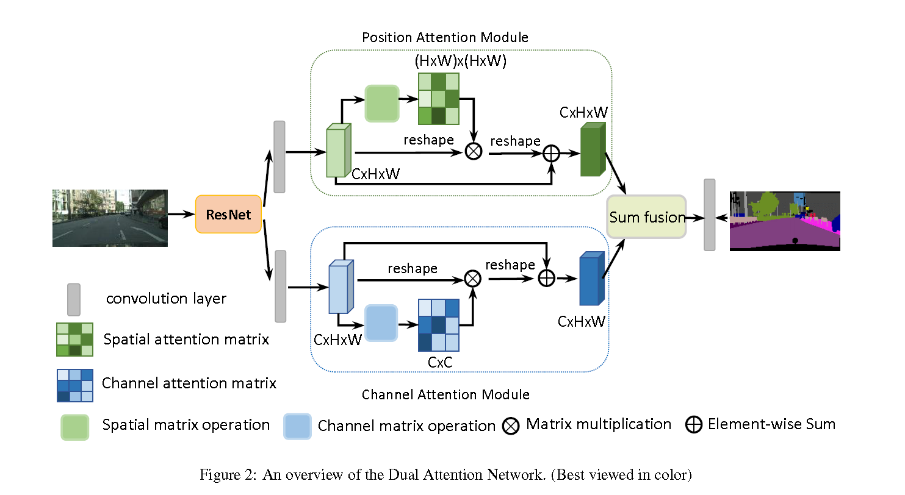
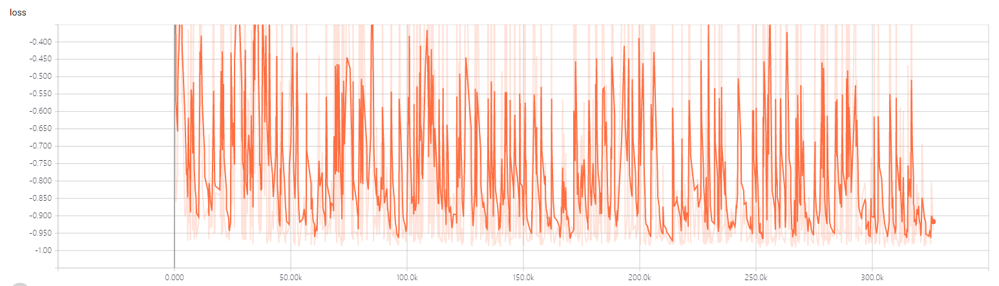
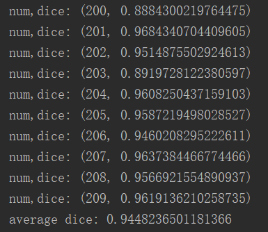

# DualAttention VNet3D Model for KiTS19——2019 Kidney Tumor Segmentation Challenge
> This is an example of DualAttention VNet3D.(re)implemented the model with tensorflow framework in the paper of "Jun Fu, Jing Liu, Haijie Tian, Yong Li, Yongjun Bao, Zhiwei Fang, Hanqing Lu.(2019) Dual Attention Network for Scene Segmentation"

## Prerequisities
The following dependencies are needed:
- numpy >= 1.11.1
- opencv-python >=3.3.0
- tensorflow-gpu ==1.8.0
- pandas >=0.20.1
- scikit-learn >= 0.17.1

## How to Use

*Preprocess*

follow KiTS19——2019 Kidney Tumor Segmentation Challenge project

* Position Attention Model and Channel Attention Model

## Prerequisities
DANet: Dual Attention Network for Scene Segmentation (CVPR2019) can find from here:https://github.com/junfu1115/DANet

## Result
**1、Kidney Segmentation**
* the train loss

* 200-209case dice value and result

## Contact
* https://github.com/junqiangchen
* email: 1207173174@qq.com
* Contact: junqiangChen
* WeChat Number: 1207173174
* WeChat Public number: 最新医学影像技术
